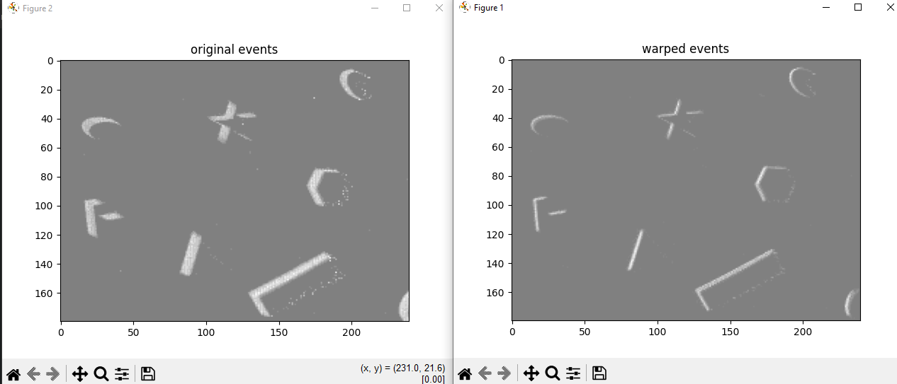

# Contrast Maximization Framework Implementation

**Python Version 3.10 and higher**

TODO :

1. Speed up code with numba or something
2. Figure out how the exponential matrix warping thing works
3. Maybe add Gaussian blur for calculating the variance
4. Add velocity to account for drift (May lose a lot of accuracy)

---

### How to install

1. Create virtual environment with `python -m venv venv`
2. Activate Virtual environment

- Windows : `./venv/scripts/activate`
- Mac/Linux : `source ./venv/bin/activate`

3. Install dependencies with
   `pip install -r requirements.txt`

4. Edit your config.py

### How to run

- `python main.py [-r READ_LIMIT] [-t TIME_START]`

  READ_LIMIT - limits the number of lines/events read, default -1 (all lines read)

  TIME_START - is t0, default from config.py

---

## Example Image

## 

Test Dataset from "The Event-Camera Dataset and Simulator: Event-based Data for Pose Estimation, Visual Odometry, and SLAM" (Mueggler, et al. 2017)

Implementation of the paper "A Unifying Contrast Maximization Framework for Event Cameras, with Applications to Motion, Depth, and Optical Flow Estimation" (Gallego, et al., 2018).
